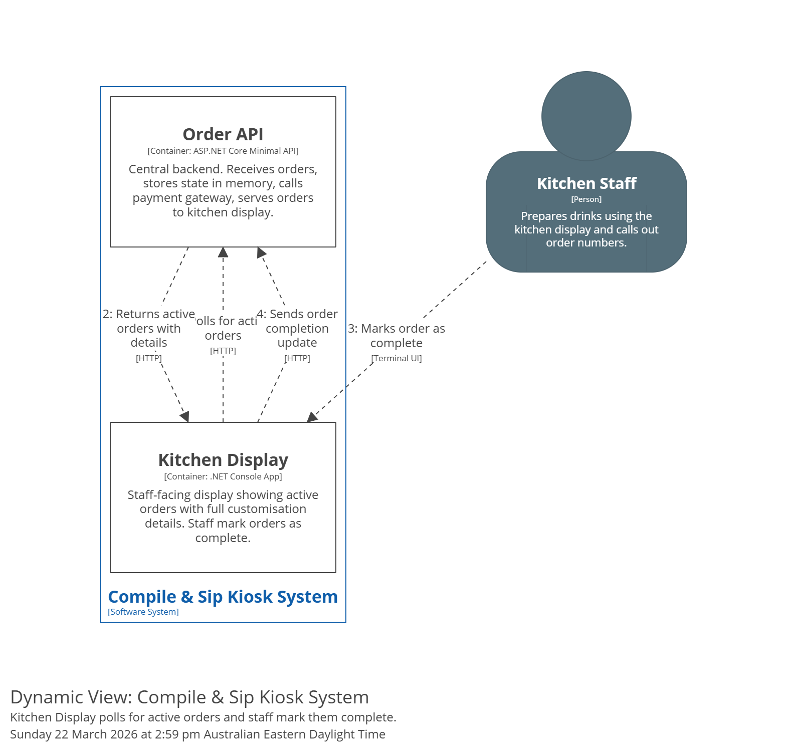

# FLW-KDS-001: Display and Complete Orders

**Level:** component

## Summary

Covers the Kitchen Display's lifecycle: poll the Order API for active orders, display them with full customisation details, allow kitchen staff to mark orders as complete, and update the Order API. The verbal callout to the customer happens outside the system.

## Participants

| Participant | Role |
|-------------|------|
| Kitchen Staff | Actor — views orders and marks them complete |
| Kitchen Display — Order List | Displays active orders in received sequence with full details |
| Kitchen Display — Polling Loop | Periodically fetches active orders from the Order API |
| Order API | Data source — provides active orders and accepts completion updates |

## Sequence

1. **Polling Loop** sends an HTTP request to the **Order API** to fetch all active orders (paid, not yet completed).
2. **Order API** returns the list of active orders, each with full customisation details (drink name, milk type, toppings, sugar level, ice level, temperature, order number).
3. **Order List** displays the orders in the sequence they were received. Each order shows all customisation details at a glance.
4. A new order appears on the display after the next poll following a successful payment (poll interval ~2–3 seconds).
5. **Kitchen Staff** prepares the drink following the displayed specifications.
6. **Kitchen Staff** marks the order as complete via a single action (button/keypress) on the **Order List**.
7. **Kitchen Display** sends an HTTP request to the **Order API** to mark the order as complete.
8. **Order API** updates the order status. The order is removed from the active list on the next poll.
9. **Kitchen Staff** verbally calls out the order number for the customer to pick up.

## Scenarios

This flow supports the following business scenario:

- [SCN-005 — Kitchen Marks Order Complete](../../../../business/scenarios/SCN-005-kitchen-marks-order-complete.md) (steps 1–9)

## C4 dynamic view

View key: `FLW-KDS-001-display-and-complete-orders` in [workspace.dsl](../../../c4-model/workspace.dsl).

