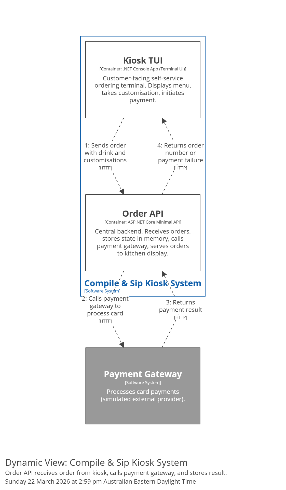

# FLW-API-001: Process Order and Payment

**Level:** container

## Summary

Covers the Order API's orchestration when it receives an order from the Kiosk TUI: validate the order, call the payment gateway to process the card payment, handle success or failure, store the order in memory on success, and return the result to the kiosk.

## Participants

| Participant | Role |
|-------------|------|
| Kiosk TUI | Caller — submits the order and receives the result |
| Order API | Orchestrator — validates, coordinates payment, stores the order |
| Payment Gateway | External system — processes the card payment (simulated) |

## Sequence

1. **Kiosk TUI** sends an HTTP request to the **Order API** containing the completed order (drink selection + all customisations).
2. **Order API** validates the order data (drink exists, customisation options are valid).
3. **Order API** calls the **Payment Gateway** via HTTP to process the card payment.
4. **Payment Gateway** returns the payment result (success or failure).
5. **On payment success:**
   - Order API assigns a sequential order number.
   - Order API stores the order in memory with status "paid".
   - Order API returns the order number to the Kiosk TUI.
   - The order is now visible to the Kitchen Display on its next poll.
6. **On payment failure (declined):**
   - Order API does not store the order.
   - Order API returns a payment-failed result to the Kiosk TUI.
7. **On payment gateway unavailable:**
   - Order API does not store the order.
   - Order API returns a gateway-unavailable result to the Kiosk TUI.

## Scenarios

This flow supports the following business scenarios:

- [SCN-003 — Payment Succeeds](../../../../business/scenarios/SCN-003-payment-succeeds.md) (steps 1–5)
- [SCN-004 — Payment Fails](../../../../business/scenarios/SCN-004-payment-fails.md) (steps 1–4, 6–7)

## C4 dynamic view

View key: `FLW-API-001-process-order-and-payment` in [workspace.dsl](../../../c4-model/workspace.dsl).

