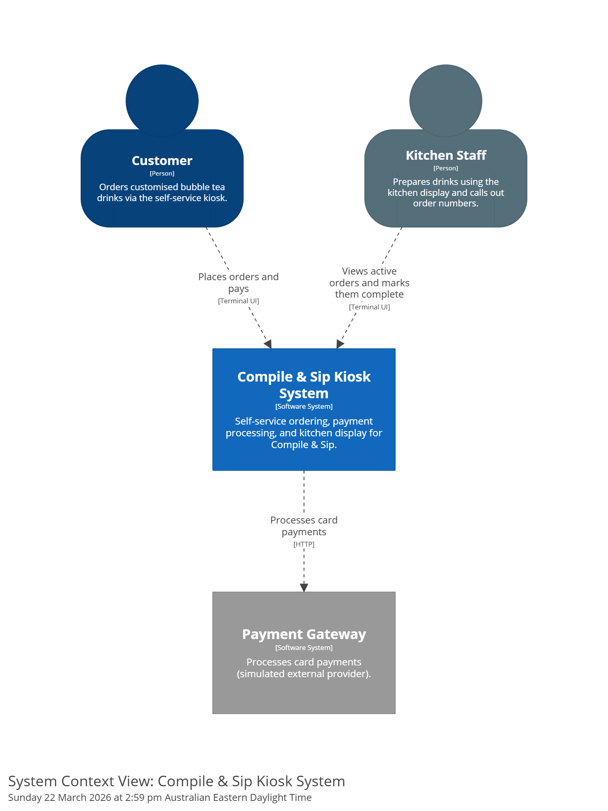

# Solution Context



## System boundary

The Compile & Sip Kiosk System encompasses everything needed to take a customer's order, process payment, and display the order to kitchen staff. It consists of three applications: a customer-facing ordering terminal (Kiosk TUI), a central backend (Order API), and a staff-facing kitchen display.

The system boundary ends at the payment gateway — payment processing itself is handled by an external provider. Within the boundary, all state is held in memory by the Order API; there is no database or persistent storage.

## External systems

| System | Role | Integration Pattern |
|--------|------|-------------------|
| Payment Gateway | Processes card payments | REST API call (simulated) |

## Architecture narrative

This is a **transition architecture** — deliberately simpler than the full vision, because the project is a reference example for the Why–What–How framework.

**Current state (MVP):**

- In-memory storage within the Order API process. No database, no persistence across restarts.
- REST/HTTP communication between all applications. Kitchen Display polls the Order API for updates.
- Single kiosk instance. No concurrency concerns or multi-instance coordination.
- Simulated payment gateway. Demonstrates the external system boundary without requiring real credentials.
- No authentication. No user accounts, no staff login.

**Full vision (beyond MVP):**

The longer-term direction described in the business vision — loyalty programs, mobile ordering, sales analytics, multi-location support — would require:

- Persistent storage (database) for order history, customer profiles, and analytics.
- Authentication and authorisation for staff and customer accounts.
- Event-driven communication (replacing HTTP polling) for real-time kitchen updates and notifications.
- Additional client applications (mobile app as a second consumer of the Order API).

**Why start simple:**

Every simplicity choice is deliberate. Three drinks keep menu browsing demonstrable without data management complexity. In-memory storage eliminates infrastructure setup. REST/HTTP polling avoids message broker dependencies. The goal is to demonstrate the documentation framework, not to build a production-ready system. See [ADR-0001](../decisions/ADR-0001-solution-dotnet-platform.md), [ADR-0002](../decisions/ADR-0002-application-order-api-in-memory-storage.md), and [ADR-0003](../decisions/ADR-0003-solution-rest-http-polling.md) for the key technology decisions.

## Data flow summary

```
Customer → [Kiosk TUI] → HTTP → [Order API] → HTTP → [Payment Gateway (external)]
                                      ↑
                          HTTP (poll) |
                                      |
                          [Kitchen Display]
```

- **Kiosk TUI → Order API** — submits orders and initiates payment (HTTP).
- **Order API → Payment Gateway** — processes card payment (HTTP, simulated).
- **Order API** — stores orders in memory.
- **Kitchen Display → Order API** — polls for new/active orders, marks orders complete (HTTP).
